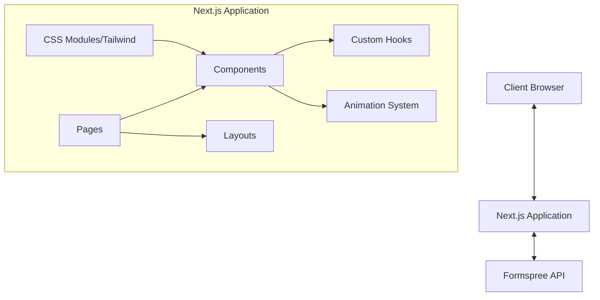
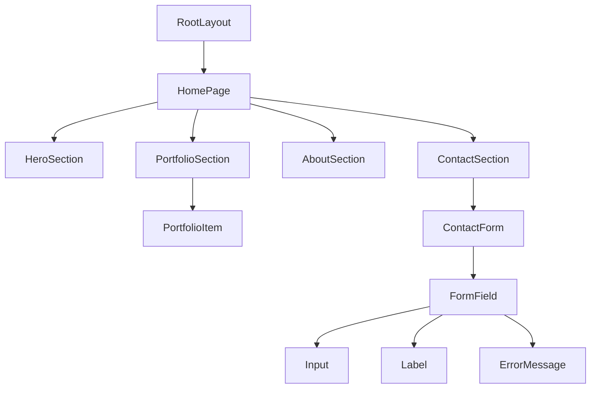

# IDFSUIT Productions LLC - System Patterns

## System Architecture

The IDFSUIT Productions website follows a modern single-page application architecture built on Next.js, leveraging its hybrid static and server rendering capabilities.

## Key Technical Decisions

### 1. Next.js App Router
- Using the modern App Router architecture (src/app directory structure)
- Leveraging React Server Components for improved performance
- Utilizing the built-in routing system for the single-page experience

### 2. Styling Approach
- Implementing a responsive design system
- Using modern CSS features (CSS variables, flexbox, grid)
- Potentially incorporating Tailwind CSS for utility-first styling
- Dark mode as primary design with noir aesthetic

### 3. Animation Strategy
- Subtle, sophisticated animations that enhance the noir aesthetic
- Scroll-triggered animations for content sections
- Smooth transitions between sections
- Performance-optimized animation techniques

### 4. Form Integration
- Formspree integration for contact form handling
- Client-side validation before submission
- Success/error state handling

## Design Patterns

### Component Architecture
- Atomic design methodology
  - Atoms: Basic UI elements (buttons, inputs, typography)
  - Molecules: Simple component combinations (form fields, cards)
  - Organisms: Complex UI sections (hero section, portfolio grid)
  - Templates: Page-level component arrangements

### State Management
- React's built-in state management for component-level state
- Context API for theme and potentially other global states
- Server Components for data that doesn't require client-side interactivity

### Responsive Design Pattern
- Mobile-first approach
- Fluid typography system
- Responsive layout using CSS Grid and Flexbox
- Strategic breakpoints for optimal viewing across devices

## Component Relationships

## Performance Optimization Patterns

1. **Image Optimization**
   - Using Next.js Image component for automatic optimization
   - Proper sizing and formats for noir-style visuals
   - Lazy loading for off-screen images

2. **Code Splitting**
   - Automatic code splitting by Next.js
   - Dynamic imports for larger components when necessary

3. **Font Loading Strategy**
   - Optimized font loading with font-display swap
   - Limited font variations to maintain performance

4. **Animation Performance**
   - Using CSS transforms and opacity for smooth animations
   - Leveraging requestAnimationFrame for JavaScript animations
   - Monitoring for jank and optimizing as needed

## SEO Implementation

- Metadata optimization using Next.js Head components
- Semantic HTML structure
- Structured data for rich search results
- Optimized for core web vitals